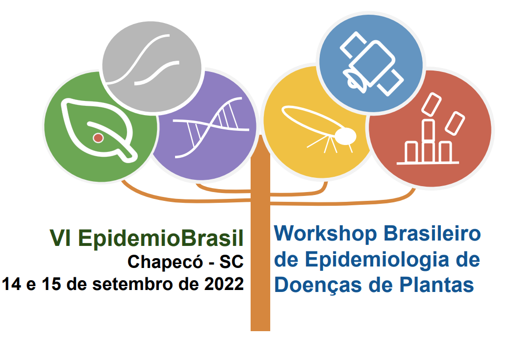
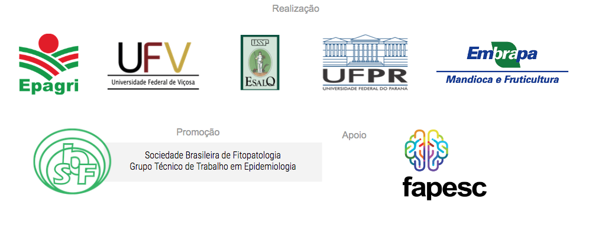

> [Confira imagens do evento](https://drive.google.com/drive/folders/1MVlZzKBMZGN7WFvuU31ibeUooSiTXSyT)

O **VI EpidemioBrasil** - Workshop de Epidemiologia de Doenças de Plantas, será realizado em Chapecó nos dias 14 a 15 de setembro de 2022. O evento é organizado por pesquisadores da Empresa de Pesquisa Agropecuária e Extensão Rural de Santa Catarina (EPAGRI) em parceria com pesquisadores da UFV, ESALQ-USP, UFPR e Embrapa Mandioca e Fruticultura, com o apoio da Sociedade Brasileira de Fitopatologia (SBF) por meio do Grupo Temático de Trabalho em Epidemiologia, com suporte financeiro da Fundação de Amparo à Pesquisa e Inovação do Estado de Santa Catarina (FAPESC).

\
**Comissão Organizadora**\
Presidente: Maria Cristina Canale (Epagri)\
Vice-Presidente: Cristiano Nunes Nesi (Epagri)

**Comitê Técnico-Científico**\
Armando Bergamin Filho (ESALQ/USP)\
Emerson M. Del Ponte (UFV)\
Francisco Laranjeira (Embrapa)\
Lilian Amorim (ESALQ/USP)\
Louise Larissa May De Mio (UFPR)

**Equipe de Apoio**\
Rodolfo Vargas Castilhos (Epagri)\
Eduardo César Brugnara (Epagri)\
Sônia Maria Bortolanza (Epagri)\
Agnes Etges (Epagri)

